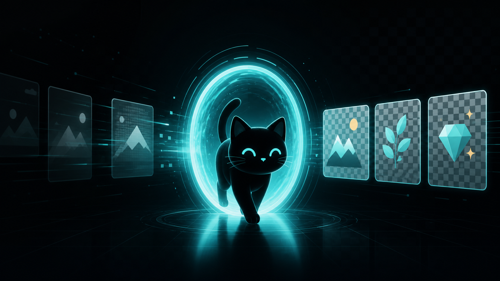

  

<h1 align="center">Quick BRT</h1>

<b>Remove backgrounds and resize images in batches. Instantly.</b>

  
  &nbsp;
  

  
  
  

---

## Download and use

Windows, no installer, no account required.

1. **Download** the latest build with the button above, or pick a version from the [Releases page](https://github.com/dryram3n/quick-brt-releases/releases/latest).
2. **Unzip every file into one folder** and keep them together.
3. **Run `Quick BRT.exe`** and drop in your images.

> **SmartScreen warning?** Windows may say the app is unrecognized (it is unsigned, not malware). Click **More info**, then **Run anyway**.
>
> **Smart AI mode** (any-background removal: people, fur, complex scenes) ships inside the full build. If you delete the `smart_ai` folder to reclaim space, the app re-downloads it on demand the next time you enable Smart mode.

The full download is the complete app including Smart AI. Your recipes live in your user config folder, so they survive an update.

### What changed in v0.2.1

- Hardened Smart AI downloads with checksum verification, staged extraction, and archive safety checks.
- Improved automatic background detection, EXIF orientation handling, and WebP size targeting.
- Added collision-safe batch renaming, safer grid output naming, and oversized-image protection.
- Prevented app shutdown while background workers are still active.

---

## What is Quick BRT?

Quick BRT is a Windows workflow studio by [ThrombloCreates](https://www.thromblocreates.com) for building reusable batch image recipes. Add a folder once, arrange background removal, crop, resize, adjustments, watermarking, and sprite creation into an ordered stack, preview the result, then process the entire batch without modifying the source files.

It removes only the edge-connected background, so same-color detail inside the subject is preserved. For solid backgrounds it is instant and offline. For anything arbitrary, the optional Smart (AI) mode handles it.

  <b>Ordered recipes</b> &nbsp;·&nbsp; <b>Interactive preview</b> &nbsp;·&nbsp; <b>Smart AI removal</b> &nbsp;·&nbsp; <b>Atomic batch engine</b> &nbsp;·&nbsp; <b>Portal-cat UI</b>

---

## Highlights

- **Edge-aware background removal** that clears only the edge-connected background and keeps same-color detail inside the subject, with tunable tolerance, feather, and edge cleanup.
- **Auto detect plus color presets:** Auto finds the dominant border-color bucket and works on any solid color. Black, Green, White, and Custom (color picker) are one click away.
- **Smart (AI) mode** uses a neural network (rembg) to remove any background: people, fur, complex scenes. Optional one-time download (~120 MB) that you can delete and re-fetch on demand.
- **Discord-oriented size targets** with automatic quality reduction and an option to resize only when a file is actually over the limit. Transparent WebP by default, lossless PNG fallback.
- **Ordered recipe stacks** combine background removal, resize, crop, rotate, adjustments, watermarking, and sprite creation in one non-destructive batch.
- **Interactive preview canvas** supports zoom, checkerboard transparency, before-and-after comparison, direct crop drawing, and per-image overrides.
- **Safe exports** provide filename templates, metadata policy, format and quality controls, conflict preflight, atomic writes, cancellation, and structured results.
- **Reusable recipe files** can be saved, shared, reopened, and optionally created from legacy one-tool presets.
- **Portal-cat visual system** gives empty, working, success, and error states a consistent custom identity without covering the controls.

---

## Workflow studio

### Background removal

- **Auto detect** mode samples the dominant border color and removes it. Works on any solid color.
- **Color presets:** Black, Green, White, and Custom (with a color picker).
- **Smart (AI) mode:** any-background removal via rembg. Optional one-time ~120 MB download; delete the `smart_ai` folder to reclaim space and the app re-downloads it on demand.
- Removes only edge-connected background, preserving same-color detail inside the subject.
- Transparent WebP output by default, PNG fallback for lossless.
- Discord-oriented size targets with automatic quality reduction and optional resize only when needed.

- **Sources:** add files or recursive folders once, inspect image and EXIF details, remove individual inputs, and preview any selected image.
- **Recipe:** add, reorder, enable, duplicate, and configure processing steps. Background removal stays first and grid or sprite output stays last.
- **Canvas:** compare before and after, inspect transparency, zoom, and draw per-image crop rectangles directly.
- **Expanded tools:** padded and no-upscale resizing, free-angle rotation, exposure, gamma, temperature, tint, text or logo watermarks, transparent grids, trimming, and power-of-two sprite canvases.
- **Export:** choose PNG, JPEG, WebP, BMP, TIFF, GIF, or source format, then control quality, metadata, naming tokens, and collision behavior.
- **Results:** review every output and failure after a run while partial files remain hidden through atomic writes.

### UI and brand

- Original portal-cat application icon and semantic artwork for empty, drag, working, success, and error states.
- OLED-black surfaces with cyan portal lighting, centralized design tokens, visible keyboard focus, and reduced-motion support.
- A three-pane workspace that remains usable at 1024 x 700 and scales cleanly on high-DPI Windows displays.
- Menu shortcuts for adding sources, opening and saving recipes, running the current recipe, and viewing the workflow guide.

---

## Recommended defaults

For background removal: `Auto detect` color, `WebP transparent` format, `8 MB Discord-safe` size target, Tolerance `18`, Feather `1`, Edge cleanup `18`, Parallel workers `Auto`, resize only if needed.

If too much of the subject is removed, lower `Tolerance` and `Edge cleanup`. If a colored outline remains, raise them slightly. For tricky backgrounds, switch to the specific color or use `Custom`. For arbitrary backgrounds (people, fur, scenes), turn on `Smart (AI) mode`.

---

  

  A <a href="https://www.thromblocreates.com/quickbrt/">Thromblo Creates</a> tool &nbsp;·&nbsp; Windows builds are unsigned &nbsp;·&nbsp; This repository hosts the downloadable releases. See <a href="https://github.com/dryram3n/quick-brt-releases/releases">Releases</a> for version history and patch notes.

