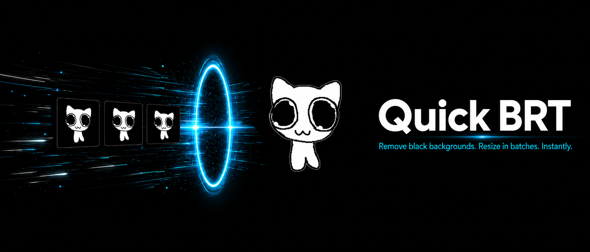

  

<h1 align="center">Quick BRT</h1>

<b>Remove backgrounds and resize images in batches. Instantly.</b>

  
  &nbsp;
  

  
  
  

---

## Download and use

Windows, no installer, no account required.

1. **Download** the latest build with the button above, or pick a version from the [Releases page](https://github.com/dryram3n/quick-brt-releases/releases/latest).
2. **Unzip every file into one folder** and keep them together.
3. **Run `Quick BRT.exe`** and drop in your images.

> **SmartScreen warning?** Windows may say the app is unrecognized (it is unsigned, not malware). Click **More info**, then **Run anyway**.
>
> **Smart AI mode** (any-background removal: people, fur, complex scenes) ships inside the full build. If you delete the `smart_ai` folder to reclaim space, the app re-downloads it on demand the next time you enable Smart mode.

Two downloadable bundles are published with every release:

- **`QuickBRT-windows-latest.zip`** the full app, Smart AI included. This is the one you want.
- **`QuickBRT-smart-windows-latest.zip`** the Smart AI only bundle, used by the in-app downloader if you remove and later re-enable Smart mode.

The Smart AI bundle also includes a SHA-256 sidecar that the app verifies before installing executable code.

### What changed in v0.2.1

- Hardened Smart AI downloads with checksum verification, staged extraction, and archive safety checks.
- Improved automatic background detection, EXIF orientation handling, and WebP size targeting.
- Added collision-safe batch renaming, safer grid output naming, and oversized-image protection.
- Prevented app shutdown while background workers are still active.

---

## What is Quick BRT?

Quick BRT is a Windows desktop app by [ThrombloCreates](https://www.thromblocreates.com) for batch-removing image backgrounds and batch-processing images for Discord workflows. Drop in a folder, and it chews through every image in parallel: clears the background, hits a Discord size target, resizes, converts, watermarks, and more, all in an OLED true-black UI.

It removes only the edge-connected background, so same-color detail inside the subject is preserved. For solid backgrounds it is instant and offline. For anything arbitrary, the optional Smart (AI) mode handles it.

  <b>Auto + 4 color modes</b> &nbsp;·&nbsp; <b>Smart AI removal</b> &nbsp;·&nbsp; <b>10 tool tabs</b> &nbsp;·&nbsp; <b>Parallel batch engine</b> &nbsp;·&nbsp; <b>Transparent WebP</b>

---

## Highlights

- **Edge-aware background removal** that clears only the edge-connected background and keeps same-color detail inside the subject, with tunable tolerance, feather, and edge cleanup.
- **Auto detect plus color presets:** Auto finds the dominant border-color bucket and works on any solid color. Black, Green, White, and Custom (color picker) are one click away.
- **Smart (AI) mode** uses a neural network (rembg) to remove any background: people, fur, complex scenes. Optional one-time download (~120 MB) that you can delete and re-fetch on demand.
- **Discord-oriented size targets** with automatic quality reduction and an option to resize only when a file is actually over the limit. Transparent WebP by default, lossless PNG fallback.
- **A full toolbox** beyond background removal: resizer, format converter, rotate/flip, adjustments, crop, watermark, EXIF, sprite grid, and batch rename.
- **Parallel, CPU-aware processing** with a rolling queue, so huge folders fly without choking the machine. Original filenames are retained.
- **Polished to use:** a branded launch splash, a draggable help mascot, menu bar, status bar, drag-and-drop or paste on any tab, and a preset save/load system.

---

## What is in the box

### Background removal

- **Auto detect** mode samples the dominant border color and removes it. Works on any solid color.
- **Color presets:** Black, Green, White, and Custom (with a color picker).
- **Smart (AI) mode:** any-background removal via rembg. Optional one-time ~120 MB download; delete the `smart_ai` folder to reclaim space and the app re-downloads it on demand.
- Removes only edge-connected background, preserving same-color detail inside the subject.
- Transparent WebP output by default, PNG fallback for lossless.
- Discord-oriented size targets with automatic quality reduction and optional resize only when needed.

### The rest of the tabs

- **Image Resizer:** scale presets (`x8`, `x4`, `x2`, `x1`, `/2`, `/4`, `/8`), custom dimensions, or aspect ratio plus long edge. Fit, fill/crop, and stretch behaviors.
- **Format Converter:** PNG, JPEG, WebP, BMP, TIFF, GIF.
- **Rotate / Flip:** 90/180/270 degree rotations plus horizontal/vertical flip.
- **Adjustments:** brightness, contrast, saturation, sharpen, blur.
- **Crop:** aspect-ratio presets or custom pixel coordinates with anchor positioning.
- **Watermark:** text watermark with font size, opacity, 9 positions, and custom color.
- **EXIF:** view and strip EXIF metadata.
- **Grid / Sprite:** build sprite sheets from multiple images.
- **Rename:** batch rename with patterns, prefixes, suffixes, find/replace, and sequence numbers.

### UI and brand

- Branded launch splash with the ThrombloCreates wordmark animation and a real-progress loading bar.
- OLED true-black UI with brand cyan accents matching the ThrombloCreates website.
- **Flop**, the floppy disc mascot: a draggable help assistant with context-aware tips per tab.
- Menu bar and status bar, drag-and-drop images or folders, and Ctrl+V paste on any tab.
- Preset save/load system for your favorite settings.

---

## Recommended defaults

For background removal: `Auto detect` color, `WebP transparent` format, `8 MB Discord-safe` size target, Tolerance `18`, Feather `1`, Edge cleanup `18`, Parallel workers `Auto`, resize only if needed.

If too much of the subject is removed, lower `Tolerance` and `Edge cleanup`. If a colored outline remains, raise them slightly. For tricky backgrounds, switch to the specific color or use `Custom`. For arbitrary backgrounds (people, fur, scenes), turn on `Smart (AI) mode`.

---

  A <a href="https://www.thromblocreates.com/quickbrt/">Thromblo Creates</a> tool &nbsp;·&nbsp; Windows builds are unsigned &nbsp;·&nbsp; This repository hosts the downloadable releases. See <a href="https://github.com/dryram3n/quick-brt-releases/releases">Releases</a> for version history and patch notes.

